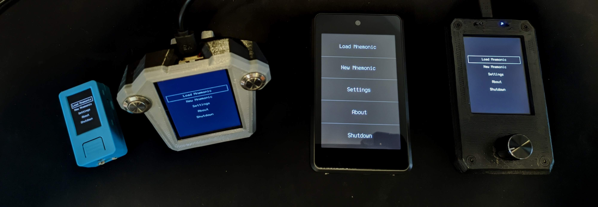

# Krux Binaries
Experimental compiled Krux binaries.

For stable releases, please download from [official repository](https://github.com/selfcustody/krux/releases/latest)



# Flash Instructions:
Make ktool executable:
```
chmod +x ktool-linux 
```

To Flash Maix Amigo run:
```
./ktool-linux -B goE -b 1500000 maixpy_amigo/kboot.kfpkg
```

To Flash M5stickV run:
```
./ktool-linux -B goE -b 1500000 maixpy_m5stickv/kboot.kfpkg
```

To Flash Maix Bit run:
```
./ktool-linux -B goE -b 1500000 maixpy_bit/kboot.kfpkg
```

To Flash Maix Dock run:
```
./ktool-linux -B dan -b 1500000 maixpy_dock/kboot.kfpkg
```

To Flash Yahboom Aimotion you'll have to manually specify the port, on this example `/dev/ttyUSB0`:
```
./ktool-linux -B goE -b 1500000 -p /dev/ttyUSB0 maixpy_yahboom/kboot.kfpkg
```

To Flash Maix Cube run:
```
./ktool-linux -B goE -b 1500000 maixpy_cube/kboot.kfpkg
```

Obs: You might need to use "sudo" if your user don't have access to serial port

# Flashing on Windows

Replace './ktool-linux' for 'ktool-win.exe' and `/` for `\` in commands. Ex:
```
ktool-win.exe -B goE -b 1500000 maixpy_amigo\kboot.kfpkg
```


# Wiring

For Maix Bit connect Buttons between pins 22, 21 and GND.

22 is for "Enter ", 21 is for "Page"

For Maix Dock connect a rotary encoder:

```
Encoder - Maix Dock
   GND <->  GND
     + <->  3V3e
    SW <-> Pin 9
    DT <-> Pin 10
   CLK <-> Pin 11
```

# 3D Print a Case

[Maix Bit](https://github.com/odudex/MaixBitCase)

[Maix Dock](https://github.com/odudex/DockEncoderCase)

# Krux FAQ

[FAQ](https://selfcustody.github.io/krux/faq/)

# More Info
Code compiled on this binaries from: https://github.com/odudex/krux/tree/odudex_develop

This binaries are NOT signed and for test purposes only
